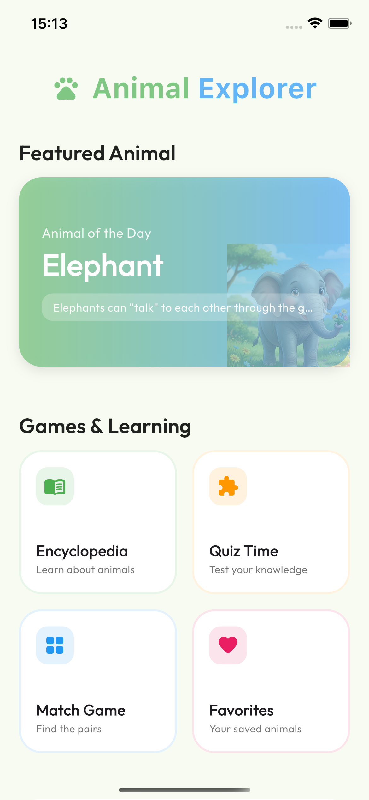
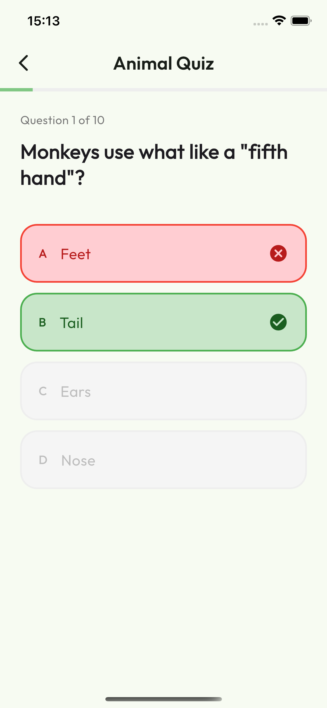
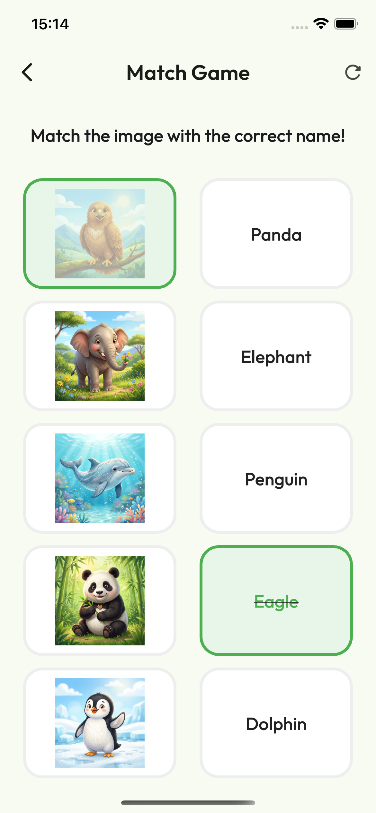
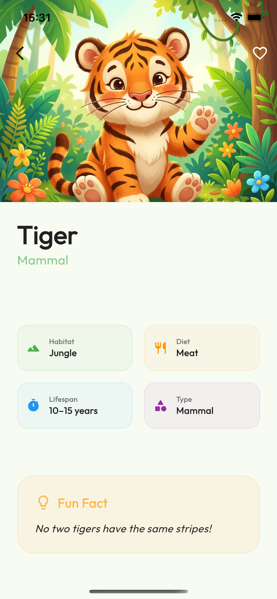
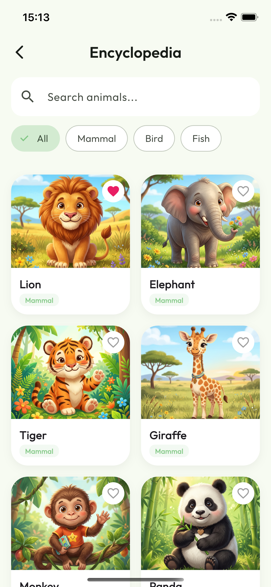

# Animal Explorer 🦁🐘🦒

A bright, friendly, and educational app designed for kids to explore the animal kingdom. Learn fun facts, test your knowledge with quizzes, and play engaging matching games!

---

## 🌟 Features

### 📖 Animal Encyclopedia
Explore 12 unique animals with beautiful, soft-textured illustrations. Each card includes:
- **Quick Stats**: Habitat, Diet, Lifespan, and Category.
- **Fun Facts**: "Did you know?" style bite-sized learning.
- **Favorites**: Kids can "Heart" their favorite animals to save them to their personal collection.

### 🧠 Interactive Quiz
- 20+ trivia questions (10 per session).
- Multiple-choice cards with instant visual feedback.
- High-score persistence to track learning progress over time.

### 🧩 Match Game
- A classic image-to-name matching game.
- Helps with recognition and vocabulary building.
- Successfully matched pairs provide clear visual cues and fun interactions.

### 🏠 Personalized Home Screen
- **Animal of the Day**: A randomized featured animal to encourage daily exploration.
- **Progress Tracking**: See your overall exploration progress (%) based on favorites and quiz scores.

---

## 🛠 Tech Stack

- **Framework**: [Flutter](https://flutter.dev)
- **State Management**: [Provider](https://pub.dev/packages/provider)
- **Persistence**: [Shared Preferences](https://pub.dev/packages/shared_preferences)
- **Design**: 
  - Custom defined `AppTheme` with soft rounded corners and vibrant pastels.
  - **Google Fonts**: High-quality [Outfit](https://fonts.google.com/specimen/Outfit) typography.

---

## 🚀 Getting Started

### Prerequisites

- [Flutter SDK](https://docs.flutter.dev/get-started/install) installed.
- A functional IDE (VS Code, Android Studio, etc.).

### Installation

1. Clone the repository:
   ```bash
   git clone <repository-url>
   ```

2. Install dependencies:
   ```bash
   flutter pub get
   ```

3. Run the application:
   ```bash
   flutter run
   ```

---

## 📸 Screenshots

| Home Screen | Quiz Screen | Match Game | Animal Detail Screen | Encyclopedia Screen |
|:---:|:---:|:---:|:---:|:---:|
|  |  |  |  |  |
---

## 📂 Project Structure

- `lib/data`: Hardcoded animal and quiz datasets.
- `lib/models`: Unified data structures for Animals and QuizQuestions.
- `lib/providers`: State management logic for favorites and progress.
- `lib/screens`: All 5 core sections of the application.
- `lib/theme`: Global design tokens and styles.
- `assets/images/animals`: Custom animal illustrations.


